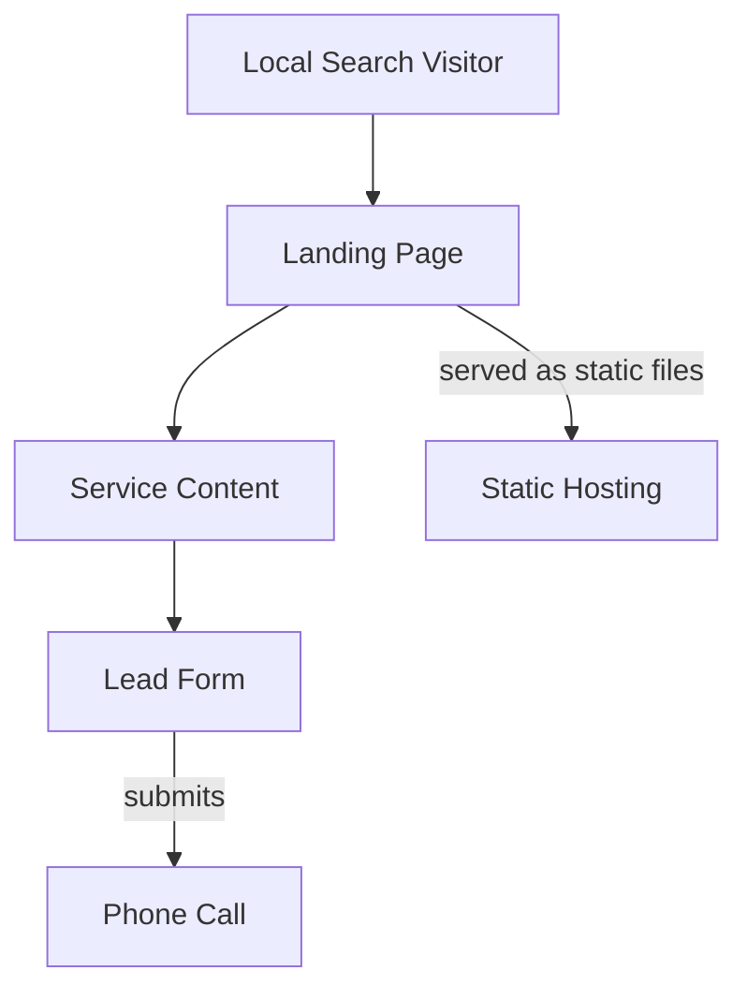

# Blueprint: savvops/window-guys-wpg

_Auto-generated architectural documentation — 2026-09-24 (Phase 1). Built from the repository file tree, README and manifests._

## Diagram

## How it works

Window Guys Winnipeg is a local service business website plus lead generator, built on the Astro basics starter template. The repo is at an early stage — the README is still the Astro starter text and the page structure (`src/pages/index.astro`, `src/components/`, `src/layouts/`) is close to the template default.

The intended shape follows Nelson's standard client-site pattern: a fast static landing page optimized for local search ("window installation Winnipeg"), service content that builds trust, and a lead form or click-to-call that converts visitors into phone calls. Deployment target is static hosting (Cloudflare Pages, matching his other sites). Note the default branch here is `master`, not `main`.

## Key files

- `src/pages/index.astro` — landing page (to be customized)
- `src/components/` / `src/layouts/` — page building blocks
- `astro.config.mjs` / `package.json` — Astro build config

## For the owner

An early-stage client-style site for a Winnipeg window company — right now it is mostly Astro starter scaffolding waiting for real content. The playbook is well-worn: turn the template into a local-SEO landing page with a prominent quote/call action, deploy static on Cloudflare. Next step is replacing the starter content with actual business copy and service pages.
